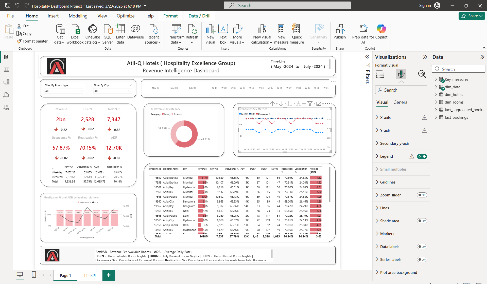

# 🏨 Atli-Q Hotels — Revenue Intelligence Dashboard
### Power BI | Hospitality Analytics | Strategic Business Insights

> **A data-driven deep-dive into hotel revenue performance, pricing strategy, and occupancy optimization for Atli-Q Hotels (Hospitality Excellence Group)**

---

## 📌 Project Overview

This project presents an end-to-end **Revenue Intelligence Dashboard** built in **Power BI** for Atli-Q Hotels — a multi-city hotel chain operating across Mumbai, Hyderabad, Bangalore, and Delhi. The dashboard tracks KPIs across the May–July 2024 timeline, enabling revenue managers and C-suite stakeholders to make data-informed decisions on pricing, channel performance, and asset optimization.

**Timeline:** May 2024 – July 2024  
**Tool:** Microsoft Power BI  
**Data Model:** Star schema with `dim_date`, `dim_hotels`, `dim_rooms`, `fact_bookings`, `fact_aggregated_bookings`

---

## 📊 Dashboard Snapshots

| Page 1 — KPI Overview | Page 2 — Weekly Trends |
|---|---|
|  |  |

---

## 🔑 Key Metrics at a Glance

| Metric | Value |
|---|---|
| **Total Revenue** | ₹2 Billion |
| **RevPAR** (Revenue Per Available Room) | ₹7,347 |
| **ADR** (Average Daily Rate) | ₹12,696 |
| **Occupancy %** | 57.87% |
| **Realisation %** | 70.15% |
| **DSRN** (Daily Saleable Room Nights) | 2,528 |
| **Cancellation %** | 24.84% |
| **Average Rating** | 3.62 |

---

## 💡 Business Insights & Strategic Recommendations

> These insights were derived from pattern analysis of weekly KPIs, property-level data, and booking channel performance. Each recommendation maps directly to a revenue optimization lever.

---

### 1. 📉 Dynamic Pricing Strategy — RevPAR is Deflecting Despite Stable ADR

**Observation:**  
The weekly trend chart (W19–W31) reveals a critical anomaly: **ADR remains relatively flat** (hovering ~₹12,600–₹12,750), while **RevPAR fluctuates significantly week-over-week** — dipping as low as ₹6,487 (W30) and as high as ₹7,896 (W29).

This divergence is the hallmark of **static pricing in a dynamic demand environment.** When RevPAR drops while ADR holds steady, it means occupancy is falling — rooms are priced the same regardless of actual demand.

**Business Impact:**  
Revenue is being left on the table during high-demand weeks and rooms are going unsold during low-demand weeks — both outcomes of a one-size-fits-all rate strategy.

**Recommendation:**  
Implement a **demand-responsive dynamic pricing engine** that adjusts room rates based on:
- **Booking lead time** (higher rates for last-minute bookings in peak weeks)
- **Competitive rate benchmarking** (real-time parity checks against OTAs)
- **Demand signals** (events, holidays, local conferences)
- **Forecasted occupancy thresholds** — e.g., if predicted occupancy > 70%, trigger a 10–15% ADR uplift

> **Target Outcome:** Stabilize RevPAR WoW volatility and push RevPAR above ₹8,000 average during peak demand windows.

---

### 2. 🗓️ Weekend vs. Weekday Pricing — An Untapped Revenue Lever

**Observation:**  
The property performance table reveals a measurable split in performance:

| Day Type | RevPAR | Occupancy % | ADR | Realisation % |
|---|---|---|---|---|
| **Weekday** | 7,082.53 | 55.85% | 12,682.41 | 69.94% |
| **Weekend** | 7,971.63 | 62.64% | 12,725.49 | 70.59% |
| **Total** | 7,336.56 | 57.79% | 12,695.75 | 70.14% |

Weekends show **~12.5% higher RevPAR** and **6.79 percentage points better occupancy** — yet the ADR differential between weekday and weekend is only **₹43.08 (0.34%).**

This means the hotel is not monetizing weekend demand surges effectively. Guests are willing to pay more on weekends, but the pricing hasn't captured that willingness.

**Recommendation:**  
- **Tiered weekend pricing:** Introduce a weekend premium of 8–12% on ADR for leisure properties (Mumbai, Bangalore)
- **Weekday corporate packages:** For business-heavy cities (Delhi, Hyderabad), bundle weekday stays with value-adds (breakfast, early check-in, loyalty points) to drive occupancy without rate dilution
- **Friday night premium:** Specifically test a Friday check-in premium as demand typically spikes from Thursday evening

> **Target Outcome:** Close the ADR gap — move weekend ADR to ₹13,500–₹14,000 while maintaining occupancy, adding an estimated ₹50–75M in incremental revenue annually.

---

### 3. ⭐ Low-Rated Property Rescue — The Pareto Principle in Hospitality

**Observation:**  
The property-level table reveals a significant **ratings disparity** across the portfolio. Multiple properties are rated **4.29–4.35** while others sit at **4.25 or below**. The average portfolio rating stands at only **3.62**, which directly correlates with suppressed occupancy.

Research consistently shows that a **0.5-star improvement in rating drives 5–9% more bookings** on OTAs. With cancellation rates averaging 24.84%, low ratings are compounding the revenue leakage.

Applying the **Pareto Principle (80/20 rule):** Approximately **20% of properties are likely responsible for 80% of rating drag** — identifying and fixing these is the highest-leverage intervention.

**Root Cause Framework:**

| Rating Band | Likely Issues | Priority Action |
|---|---|---|
| < 3.5 ★ | Cleanliness, amenities, staff responsiveness | Immediate operational audit |
| 3.5–4.0 ★ | Check-in experience, room quality, Wi-Fi | Guest journey mapping |
| 4.0–4.3 ★ | Minor service gaps, F&B quality | Targeted staff training |
| > 4.3 ★ | Maintain and leverage for marketing | Upsell & review amplification |

**Recommendation:**  
- **Property audit sprint:** Identify the bottom 3–4 rated properties; conduct guest feedback analysis (reviews, NPS, checkout surveys)
- **Issue-to-action mapping:** Translate top complaints into 30-day remediation plans (e.g., if Wi-Fi is a recurring complaint → immediate infrastructure upgrade)
- **Rating recovery tracking:** Set a KPI of +0.3 rating improvement per quarter for flagged properties
- **Occupancy uplift projection:** A property moving from 3.5★ to 4.0★ can realistically achieve a 6–8% occupancy increase, translating to ₹8–12M revenue uplift per property per year

> **Target Outcome:** Raise portfolio average rating from 3.62 to 4.0+ within 2 quarters, driving occupancy improvement in the 55–65% range for underperforming assets.

---

### 4. 🖥️ Checkout Page Optimization — Monetizing the Final Mile

**Observation:**  
The booking channel analysis shows **Atli-Q Blu (online)** and other digital platforms are significant revenue contributors. The realisation rate of **70.15%** indicates meaningful booking drop-off or cancellation — approximately **30% of potential revenue is unrealized.**

With **24.84% cancellation rate** and heavy OTA dependency, the checkout moment is the highest-leverage conversion point that is currently underutilized.

**Recommendation:**  
Deploy a structured **Checkout Conversion Optimization (CCO) strategy:**

**A. Pre-Checkout Anchoring**
- Show "Only 2 rooms left at this price" urgency signals for high-demand periods
- Display real guest reviews (4★+) contextually on the checkout page

**B. Dynamic Discount Laddering**
- Trigger **last-minute discounts (5–8%)** for rooms unfilled within 48 hours — protect RevPAR but recover contribution margin vs. empty room
- Offer **non-refundable rate discounts (10–12%)** at checkout to reduce the 24.84% cancellation rate
- Bundle offers: "Add breakfast for ₹599" or "Early check-in for ₹399" — low-cost upsells with high perceived value

**C. Loyalty & Retention Hooks**
- Offer **loyalty points bonus** for direct bookings (vs. OTA) to shift channel mix and reduce commission leakage
- Post-booking: automated email with upgrade offer within 24 hours of booking confirmation

**D. OTA vs. Direct Parity**
- For Atli-Q Blu direct bookings, offer a **"Best Rate Guarantee"** badge + a complimentary amenity to incentivize direct channel growth (reducing OTA commission of typically 15–20%)

> **Target Outcome:** Reduce cancellation rate from 24.84% to below 18% and increase Realisation % from 70.15% to 78%+, adding an estimated ₹150–200M in realized revenue annually.

---

## 🗂️ Data Model

```
dim_date ──────────────┐
dim_hotels ────────────┤──── fact_bookings
dim_rooms ─────────────┤──── fact_aggregated_bookings
Key_measures (DAX) ────┘
```

**Key DAX Measures created:**
- `RevPAR = Revenue / Total Available Room Nights`
- `ADR = Total Revenue / Total Rooms Sold`
- `Occupancy % = Rooms Sold / Rooms Available`
- `Realisation % = Successful Checkouts / Total Bookings`
- `DSRN = Daily Saleable Room Nights`
- `WoW Change % (RevPAR, ADR, Occupancy)` — for trend analysis

---

## 🛠️ Technical Skills Demonstrated

| Category | Skills |
|---|---|
| **BI Tool** | Microsoft Power BI Desktop |
| **Data Modeling** | Star Schema, Relationship management, Cardinality |
| **DAX** | Calculated measures, Time intelligence, WoW metrics |
| **Visualization** | Line charts, Donut charts, Matrix tables, KPI cards, Slicers |
| **Analytics** | Trend analysis, Segmentation, Cohort comparison, Pareto analysis |
| **Business Domain** | Hospitality KPIs (RevPAR, ADR, DSRN, DBRN, DURN, Realisation %) |
| **Storytelling** | Executive-level dashboard design, Insight-first layout |

---

## 📁 Repository Structure

```
📦 hospitality-revenue-dashboard
 ┣ 📂 screenshots
 ┃ ┣ 📸 dashboard_kpi.png
 ┃ ┣ 📸 revenue_by_category.png
 ┃ ┣ 📸 trends_by_metrics.png
 ┃ ┗ 📸 weekday_weekend_table.png
 ┣ 📂 data (sample/anonymized)
 ┃ ┣ 📄 dim_date.csv
 ┃ ┣ 📄 dim_hotels.csv
 ┃ ┣ 📄 dim_rooms.csv
 ┃ ┣ 📄 fact_bookings.csv
 ┃ ┗ 📄 fact_aggregated_bookings.csv
 ┣ 📊 Hospitality_Dashboard.pbix
 ┗ 📄 README.md
```

---

## 🎯 Business Impact Summary

| Insight | Lever | Est. Revenue Impact |
|---|---|---|
| Dynamic Pricing Implementation | RevPAR stabilization | +₹80–120M/yr |
| Weekend ADR Optimization | Pricing gap closure | +₹50–75M/yr |
| Low-Rating Property Recovery | Occupancy uplift via Pareto | +₹30–50M/yr per property |
| Checkout Conversion Optimization | Cancellation reduction + upsells | +₹150–200M/yr |

---

## 👤 About the Analyst

This project was built to demonstrate proficiency in **end-to-end data analytics** — from raw hospitality data modeling to actionable business intelligence that directly informs revenue strategy.

**Core competencies showcased:**
- Translating complex datasets into executive-ready visual narratives
- Identifying pricing and operational inefficiencies through data patterns
- Formulating quantified, implementable recommendations using analytical frameworks (Pareto, dynamic pricing theory, conversion funnel analysis)
- Domain expertise in hospitality KPIs and revenue management

---

## 📬 Connect

[](https://linkedin.com)
[](https://yourportfolio.com)
[](mailto:youremail@email.com)

---

*Built with 📊 Power BI | Insights powered by data, not assumptions.*
